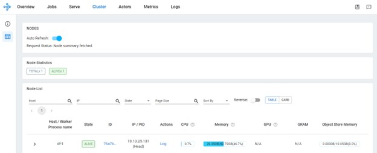
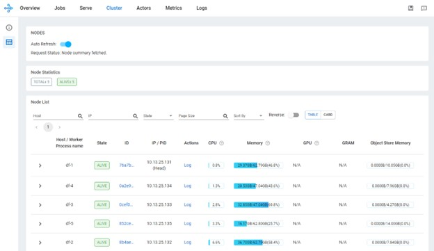

# ezmeral-df-with-ray
Ray on Ezmeral Data Fabric

## Introduction

Today the HPE Ezmeral Data Fabric does not provide the Ray software in the EEP. What a pity, as we could use a DF cluster for AI/LLM with GPU having the data sets ready on the same nodes. Hopefully Ray is not too complex to install, the provided two scripts simplify even more the installation and construction of a Ray cluster:
-	[ray-install.sh](Source-code/ray-install.sh) (install Ray, obviously)
-	[go-ray.sh](Source-code/go-ray.sh) (deploys a ray cluster on a set of nodes, including thus the case where nodes are those of a Data Fabric)

## Installing Ray

First we need to install the Ray software on Data Fabric nodes. The ray-install.sh script should work under the following Linux distributions:
-	Redhat
-	Rocky linux
-	Debian
-	ubuntu

let’s install Ray in /opt/RAY

    ./ray-install.sh /opt/RAY

For airgap environment, this script replies on the distro package management tools and on python3-pip tool. Both tool must have a repository available in the airgap environment, which is usually the case for the linux package management system. For the python3-pip, the repository must be passed as second argument:

    # ./ray-install.sh
    usage: ./ray-install.sh <installation path> [ <airgap pip repo URL> ]
    #

## Deploying a Ray cluster

Once the Ray software is installed on a set of nodes, one of them has to be selected as the _“head node"_. The head node will be then entry point for connecting to the cluster and to submit jobs. The other nodes (pure worker nodes) will be accessible through the _head node_.

### Start the head node

On the head node run the following:

    ./go-ray.sh /opt/RAY head

This will output something like the below output where you will be given the IP address to provide to other nodes to connect to:

    Usage stats collection is disabled.

    Local node IP: 10.13.25.131

    --------------------
    Ray runtime started.
    --------------------

    Next steps
      To add another node to this Ray cluster, run
        ray start --address='10.13.25.131:6379'

      To connect to this Ray cluster:
        import ray
        ray.init()

      To submit a Ray job using the Ray Jobs CLI:
        RAY_ADDRESS='http://10.13.25.131:8265' ray job submit --working-dir . -- python my_script.py

      See https://docs.ray.io/en/latest/cluster/running-applications/job-submission/index.html
      for more information on submitting Ray jobs to the Ray cluster.

      To terminate the Ray runtime, run ray stop

      To view the status of the cluster, use ray status

      To monitor and debug Ray, view the dashboard at 10.13.25.131:8265

      If connection to the dashboard fails, check your firewall settings and network configuration.

You should now be able already to connect to the dashboard as described above, in particular, looking at the “cluster” tab you will see only one node for now (the head node):

### Start all other nodes

On all other nodes run the following command using the IP address of the head node reported previously:

    ./go-ray.sh /opt/RAY worker 10.13.25.131

Of course better using clustershell to simplify the deployment on many nodes in a single command:

    clush -b -w df-[2-5] ./go-ray.sh /opt/RAY worker 10.13.25.131

After a few seconds, the “cluster” tab of the dashboard should display all the nodes involved in the cluster (including the head node):

## Submitting a job

To submit a job, we must first activate the python virtual environment (venv) where the _ray-install.py_ script installed Ray
(this is the path /opt/RAY in we were using above to illustrate the installation script).
On a node where Ray has been installed (we can also install ray in node that will not be part of the cluster,
still using _ray-install.py_), open a shell session and type the following:

> root@df-1:\~# source /opt/RAY/bin/activate 
> (RAY) root@df-1:\~#

As you see, the prompt has changed reporting now you are under the (RAY) venv. Submitting a job is done the following way (which is displayed in the output shown when starting the head node):

    RAY_ADDRESS='http://10.13.25.131:8265' ray job submit --working-dir . -- python my_script.py

For example, you can use the [__prime.py__](Examples/prime.py) script which list the prime number below a given max number. First create a new
directory for a working directory on a node of the cluster and copy the __prime.py__ script in there:

    root@df-1:~# source /opt/RAY/bin/activate
    root@df-1:~# mkdir Working
    root@df-1:~# cd Working
    root@df-1:~# cp ....../prime.py .
    root@df-1:~# export RAY_ADDRESS='http://10.13.25.131:8265'

Then submit the job to the ray cluster:

> (RAY) root@df-1:\~/Working# ray  job submit --working-dir . -- python3 prime.py 100 
> Job submission server address: http://10.13.25.131:8265 
> 2024-08-26 15:57:30,554 INFO dashboard_sdk.py:385 -- Package gcs://_ray_pkg_0ce46dc9bac19eb0.zip already exists, skipping upload. 
>  
> ------------------------------------------------------- 
> Job 'raysubmit_6TkMA4yeKnD6JPsU' submitted successfully 
> ------------------------------------------------------- 
>  
> Next steps 
>   Query the logs of the job: 
>     ray job logs raysubmit_6TkMA4yeKnD6JPsU 
>   Query the status of the job: 
>     ray job status raysubmit_6TkMA4yeKnD6JPsU 
>   Request the job to be stopped: 
>     ray job stop raysubmit_6TkMA4yeKnD6JPsU 
> 
> Tailing logs until the job exits (disable with --no-wait): 
> 2024-08-26 15:57:33,152 INFO worker.py:1432 -- Using address 10.13.25.131:6379 set in the environment variable RAY_ADDRESS 
> 2024-08-26 15:57:33,153 INFO worker.py:1567 -- Connecting to existing Ray cluster at address: 10.13.25.131:6379... 
> 2024-08-26 15:57:33,168 INFO worker.py:1743 -- Connected to Ray cluster. View the dashboard at http://10.13.25.131:8265 
> **[2, 3, 5, 7, 11, 13, 17, 19, 23, 29, 31, 37, 41, 43, 47, 53, 59, 61, 67, 71, 73, 79, 83, 89, 97]** 
>  
> ------------------------------------------ 
> Job 'raysubmit_6TkMA4yeKnD6JPsU' succeeded 
> ------------------------------------------ 
>  
> (RAY) root@df-1:\~/Working# 

***Note***: This script is just for illustration purposes, it is not efficient to spawn so many small tasks.

